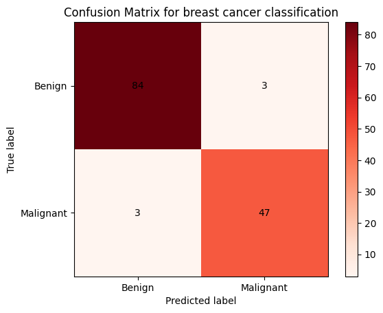
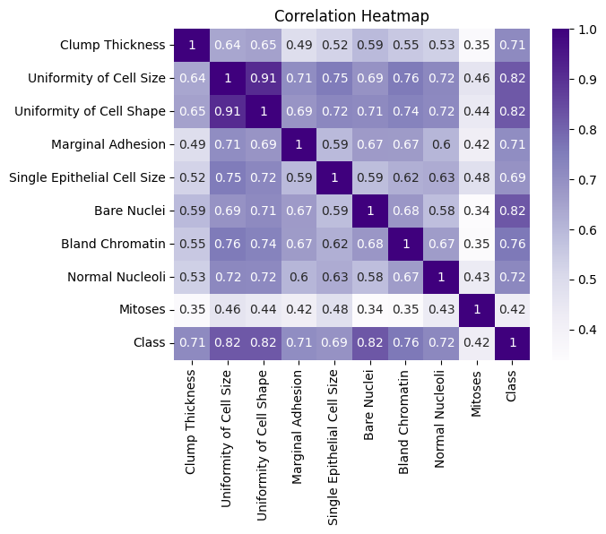

# Breast Cancer Detection using Logistic Regression

This repository contains code and data related to the analysis of breast cancer detection using logistic regression. The goal is to train a logistic regression model to classify breast cancer cases as either malignant or benign based on a set of independent variables.

## Dataset

- `breast_cancer.csv`: This file contains the dataset used for training and evaluating the logistic regression model. The dataset was obtained from the UCI Machine Learning Repository.

## Code

- `logistic_regression.py`: This Python script includes all the necessary steps to train the logistic regression model. It preprocesses the dataset, splits it into training and testing sets, trains the model, and evaluates its performance.

- `classification_model.pkl`: This file contains the trained logistic regression model saved using the pickle library. It can be loaded and used for making predictions on new data.

## Plots

- `Plots.ipynb`: This Jupyter Notebook script provides code to plot the confusion matrix of the trained logistic regression model and the correlation heat map of the data variables.

### Confusion Matrix

The confusion matrix is a visualization that shows the performance of the logistic regression model. It provides information about the true positive, true negative, false positive, and false negative predictions.

### Correlation Heat Map

The correlation heat map visualizes the pairwise correlations between the variables in the dataset. Darker colors indicate stronger correlations, while lighter colors indicate weaker correlations. From the correlation heat map, we can identify variables that are positively or negatively correlated with each other, helping us understand the interdependencies and potential patterns in the data.

## Usage

1. Clone the repository: `git clone <repository_url>`

2. Run the `logistic_regression.py` script to train and evaluate the logistic regression model.

3. Use the trained model in other applications by loading `classification_model.pkl`.

4. Explore the visualizations in the `Plots.ipynb` notebook to analyze the model's performance and the correlation between variables.

## References

- [UCI Machine Learning Repository](https://archive.ics.uci.edu/ml/index.php) - The source of the breast cancer dataset.

